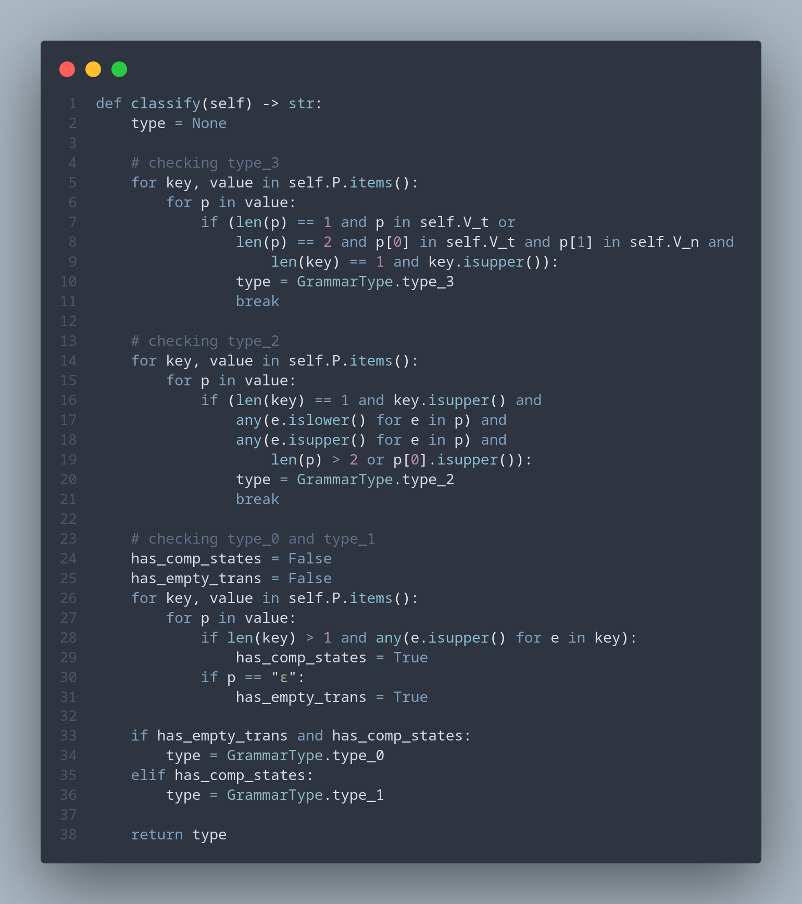
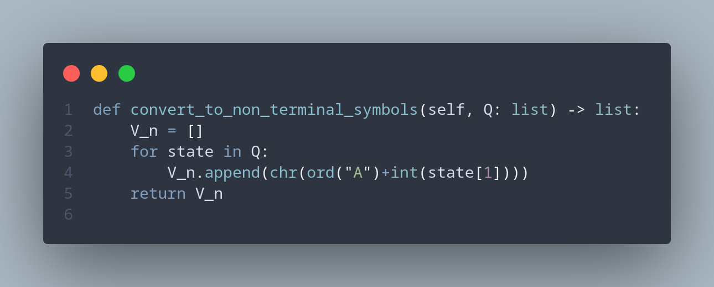
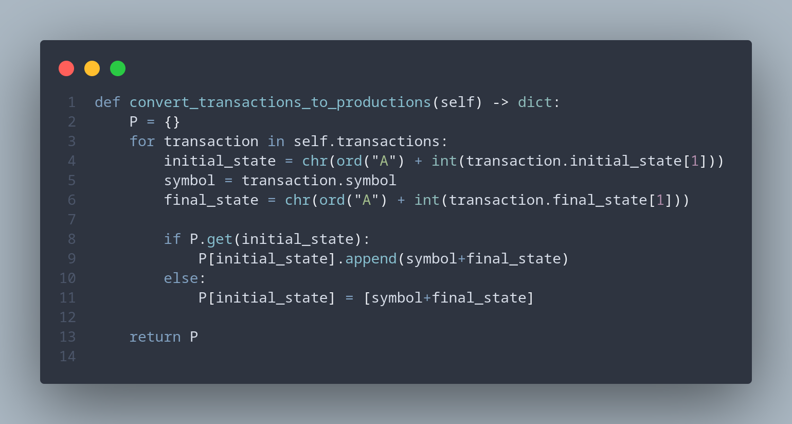
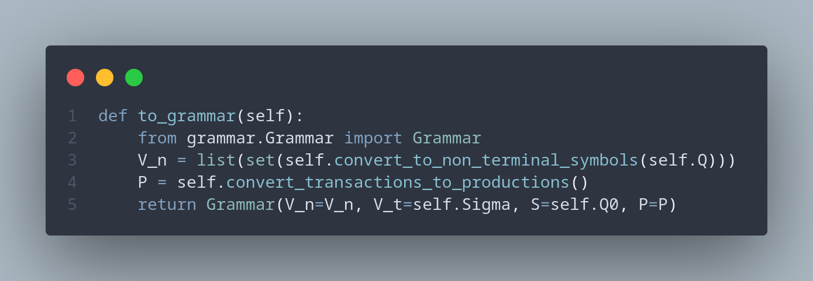
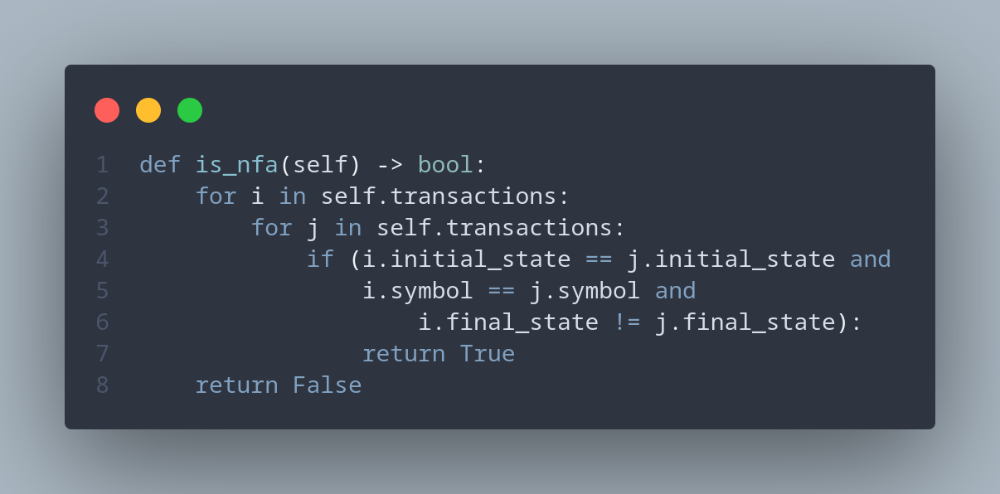
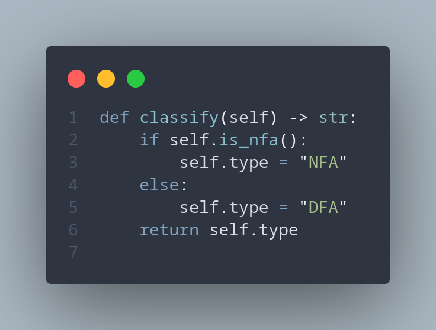
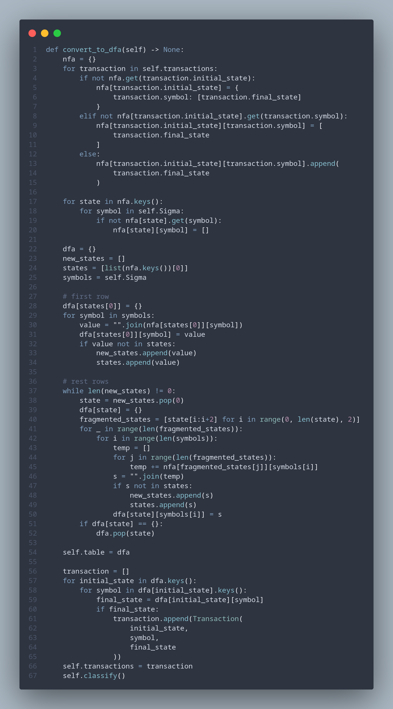

# Topic: Determinism in Finite Automata. Conversion from NDFA 2 DFA. Chomsky Hierarchy.

### Course: Formal Languages & Finite Automata
### Author: Radu Calin 

----

## Theory
Finite automaton is formed of 5 elements:
* **Q** is a set of states
* **Σ** is an input alphabet
* **δ** is a set of transitions 
* **q0** is the initial state
* **F** is a set of final states 

An automaton can be deterministic and non-deterministic. The difference being that the non-deterministic one, might have an emtpy transition or it can have a case, where from one state and one input we can get to two different states. Determinism often refers to how predictable a system is. Thus, for a automaton to be deterministic, we need not to have emtpy transition and especially the case where we can from the same conditions get to two different outcomes.  


## Objectives:
1. Understand what an automaton is and what it can be used for.

2. Continuing the work in the same repository and the same project, the following need to be added:
    a. Provide a function in your grammar type/class that could classify the grammar based on Chomsky hierarchy.

    b. For this you can use the variant from the previous lab.

3. According to your variant number (by universal convention it is register ID), get the finite automaton definition and do the following tasks:

    a. Implement conversion of a finite automaton to a regular grammar.

    b. Determine whether your FA is deterministic or non-deterministic.

    c. Implement some functionality that would convert an NDFA to a DFA.
    
    d. Represent the finite automaton graphically (Optional, and can be considered as a __*bonus point*__):
      
    - You can use external libraries, tools or APIs to generate the figures/diagrams.
        
    - Your program needs to gather and send the data about the automaton and the lib/tool/API return the visual representation.


## Implementation description

Based on the input parameters for the grammar from the first laboratory work, I've implemented a function for classifying the grammar type. The following code shows that implementation:



The implementation is quite self-explanatory, the function is setting the type for the Finite Automata, after going through a set of checks.  


In order to convert the Finite Automaton to a Regular Grammar, we needed to implement some helper functions:



The above function is converting the Finite Automaton states, usually written like this "q0", "q1", "q2" and so on, to the following format "A", "B", "C" and so on. 



And this function is used to convert the list of transitions, situated in the Finite Automaton, to a production, with the grammar-like form of states notation. 



Having those two helper functions, the conversion from a Finite Automaton to the Regular Grammar is quite simple, just return a new instance of the `Grammar` class.

We would need a way to tell what is the type of the Finite Automaton. For those goals, I've created:

A helper function



And the function itself



The implementation for converting a NFA to DFA:



Firstly, the function is converting the list of Transacations to a NFA struct. Then it creates a DFA struct, and some variables that will help us to convert the NFA struct to the DFA struct. 
After copying the first row of the NFA struct in the DFA struct, we are iterating over the `new_states`, where we add new states, that we've encountered when interating. The algorithm is quite simple, it creates new states, by joining the states which we can get at, through the picked-up state and inputs. The new states are also added to the queue and are being processed later. When no new states, it means that the dfa is done. Afterwards the transactions list is changed by using the DFA struct, and the type is also changed.  

## Conclusions / Screenshots / Results

In the result of working at this laboratory work, I've got a more deep understanding of the Chomsky Hierarchy of Grammar Types and implemented the algorithm of converting a Non-Determined Finite Automaton to a Determined Finite Automaton. 

Running the script, makes the following output:
```
Grammar type for the first lab grammar params: Regular grammar
Grammar type for the second lab: Regular grammar
The Finite Automaton type before converting it: NFA
The Finite Automaton type after converting it: DFA
```

## References

1. https://github.com/DrVasile/FLFA-Labs
2. https://github.com/DrVasile/FLFA-Labs-Examples
3. https://else.fcim.utm.md/pluginfile.php/110458/mod_resource/content/0/LFPC_Guide.pdf
4. https://www.tutorialspoint.com/automata_theory/chomsky_classification_of_grammars.htm